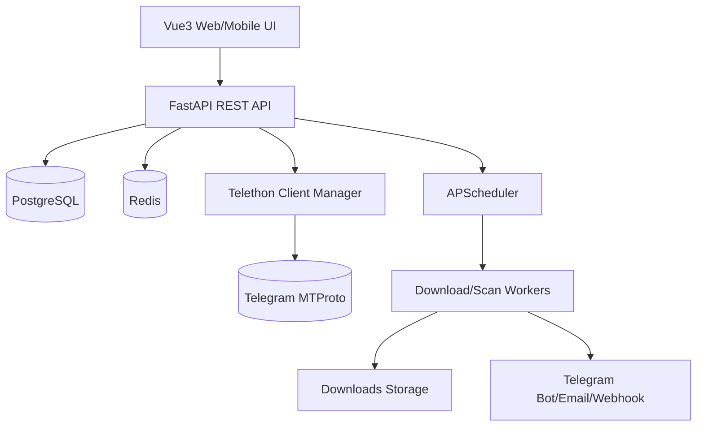

# Telegram Archive Downloader Pro

Production-oriented Telegram group/channel archive downloader with FastAPI, Telethon integration boundaries, PostgreSQL, Redis, Vue 3 UI, Docker Compose, and automated tests.

## Quick start

```bash
cp .env.example .env
# Fill TELEGRAM_API_ID and TELEGRAM_API_HASH
docker compose up -d --build
```

Open http://localhost:8080 and sign in with the default admin configured in `.env`.

## Architecture



## Features

- JWT authenticated REST API
- encrypted Telegram session storage
- multi-account model
- dialog/group/channel synchronization endpoints
- resumable download task state machine
- exponential retry policy
- storage-space guard with pause/resume status
- responsive Vue dashboard and file manager
- Docker and Docker Compose deployment
- unit/integration/load-style tests using dependency fakes

## Project layout

```text
backend/       FastAPI application, SQLAlchemy models, services, tests
frontend/      Vue 3 + TypeScript + Element Plus management UI
src/           Legacy local CLI package kept for compatibility
docker-compose.yml
.env.example
```

## Operations

Run checks locally:

```bash
cd backend
python -m pytest --cov=app --cov-report=term-missing
ruff check .
flake8 app tests
mypy app
```

## Deployment notes

Telegram login requires real `TELEGRAM_API_ID` and `TELEGRAM_API_HASH` from https://my.telegram.org. The application persists MTProto session material encrypted with `SESSION_SECRET_KEY`.
